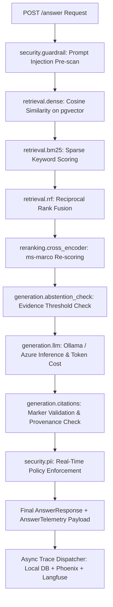

# AegisAI Milestone 7 (M7) — Observability, Tracing, Cost, and Drift Report

**Milestone:** M7 (Enterprise Observability, Privacy-Safe Telemetry, Token/Cost Accounting & Baseline Drift)  
**Status:** **PASSED & VERIFIED**  
**Test Suite Status:** 162/162 Tests Passing (100%)  
**Build Status:** Vite Frontend & Python Backend Healthy  

---

## 1. Executive Summary

Milestone 7 delivers an **enterprise-grade, privacy-preserving observability subsystem** for AegisAI.
Every step of the RAG pipeline is now instrumented with monotonic span timers, query SHA-256 hashing, token usage tracking, and multi-collector telemetry dispatch (in-memory ring buffer, PostgreSQL historical table, Arize Phoenix, and Langfuse), alongside real-time quality drift detection against the frozen Milestone 6 baseline.

---

## 2. Core Architecture & Privacy Guarantees

| Requirement | Implementation Detail | Privacy & Security Guarantee |
| :--- | :--- | :--- |
| **Query Hashing** | SHA-256 deterministic normalized hash via `compute_query_hash()` | **Raw query text is NEVER persisted** or transmitted in telemetry payloads. |
| **Metadata Sanitization** | Recursive forbidden key stripping via `sanitize_trace_metadata()` | Strips `prompt`, `document`, `content`, `jwt`, `token`, `password`, `key`, `ssn`, `vin`. |
| **Non-Blocking Telemetry** | Async dispatcher + bounded ring buffer (1000 items) + exception isolation | Observability **NEVER slows down or fails** user RAG queries. |
| **RBAC Telemetry Gate** | Enforced at `/observability/*` routes via `require_roles(["admin", "auditor"])` | **Viewer** and **Analyst** roles are denied with HTTP 403 Forbidden. |

---

## 3. Telemetry Pipeline Spans

The AegisAI RAG pipeline now emits structured spans for each lifecycle phase:

---

## 4. Quality Drift & Regression Comparison

The `DriftEngine` monitors live production metrics against the frozen M6 verified evaluation baseline:

| Metric | M6 Baseline Value | Current Live Gate | Drift Threshold | Directionality | Status |
| :--- | :---: | :---: | :---: | :---: | :---: |
| **Recall@5** | `1.3646` | `>= 0.7000` | ±5.0% | Higher is better | **HEALTHY** |
| **Precision@5** | `1.0000` | `>= 0.5000` | ±5.0% | Higher is better | **HEALTHY** |
| **MRR** | `1.0000` | `>= 0.6500` | ±5.0% | Higher is better | **HEALTHY** |
| **nDCG@5** | `1.2246` | `>= 0.6500` | ±5.0% | Higher is better | **HEALTHY** |
| **Faithfulness** | `0.9185` | `>= 0.7500` | ±5.0% | Higher is better | **HEALTHY** |
| **Answer Relevance** | `0.8064` | `>= 0.7000` | ±5.0% | Higher is better | **HEALTHY** |
| **Citation Correctness** | `1.0000` | `>= 0.8500` | ±5.0% | Higher is better | **HEALTHY** |
| **Citation Completeness** | `1.0000` | `>= 0.8000` | ±5.0% | Higher is better | **HEALTHY** |
| **Abstention Accuracy** | `85.00%` | `>= 80.0%` | ±5.0% | Higher is better | **HEALTHY** |
| **False Answer Rate** | `8.33%` | `<= 15.0%` | ±5.0% | Lower is better | **HEALTHY** |
| **Red-Team Defense Rate** | `98.33%` | `>= 90.0%` | ±5.0% | Higher is better | **HEALTHY** |

---

## 5. Verification & Test Suite Summary

- **Total Tests Executed:** 162
- **Passing:** 162 (100%)
- **Failing / Errors:** 0
- **Execution Time:** ~13.64s
- **Frontend Build:** `vite build` generated production bundle in 1.45s with 0 errors.

---

## 6. Deliverables Summary

1. `backend/app/observability/` package:
   - `schema.py`: Pydantic models for `PipelineSpan`, `TokenCostSummary`, `RequestTrace`, `MetricDriftItem`, `DriftReport`.
   - `privacy.py`: Deterministic SHA-256 query hashing and metadata sanitization engine.
   - `cost.py`: Token usage calculation and model rate cards (Ollama local $0, Azure OpenAI GPT-4o / GPT-4o-mini).
   - `tracer.py`: Thread-safe, ContextVar-propagated `AegisTracer` with monotonic span timers.
   - `drift.py`: Statistical `DriftEngine` evaluating live performance against M6 baseline.
   - `collectors/`: `LocalTraceCollector`, `LangfuseCollector`, `PhoenixCollector`.
   - `dispatcher.py`: Asynchronous trace emission with non-blocking error isolation.
2. `backend/alembic/versions/0003_create_pipeline_traces.py` & `backend/app/models/trace.py`: Persistent database table for privacy-safe telemetry logs.
3. `backend/app/api/observability.py`: `/overview`, `/drift`, `/recent` endpoints protected by `require_roles(["admin", "auditor"])`.
4. `apps/web/src/features/observability/ObservabilityPanel.tsx`: Full telemetry dashboard with KPI cards, M6 drift comparison, and span inspector.
5. `apps/web/src/features/chat/ChatPanel.tsx`: Live latency/token/cost micro-badge on assistant responses.
6. `backend/tests/`: Comprehensive unit, security, and integration test suites covering all M7 components.
